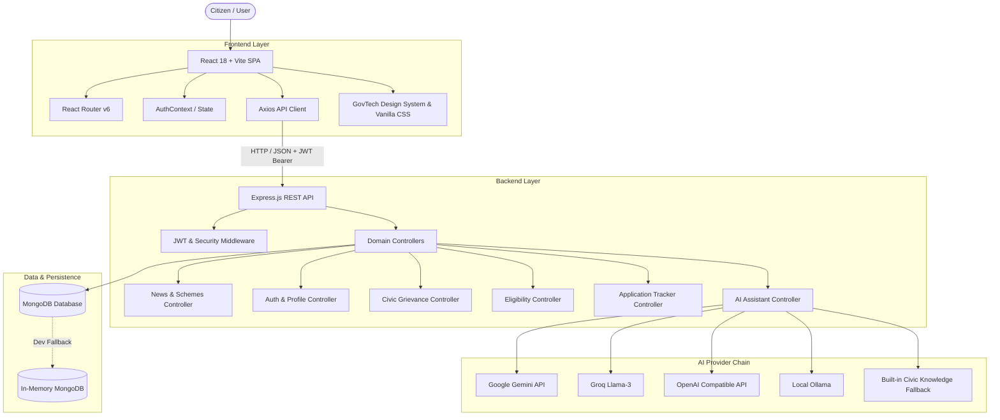

# SevaAI — Multilingual Citizen Services & GovTech Intelligence Platform

**SevaAI** is a unified, accessible, and intelligent digital governance platform engineered to simplify citizen interactions with public services, welfare schemes, civic grievance redressal, and right-to-information filings across India.

Combining a modern, responsive **React (Vite)** interface with an **Express (Node.js)** REST API and **MongoDB** persistence, SevaAI delivers structured, actionable public-service guidance without forcing citizens to navigate fragmented departmental websites.

---

## 📑 Table of Contents

- [Key Features & Modules](#-key-features--modules)
- [Architecture & Tech Stack](#-architecture--tech-stack)
- [Repository Structure](#-repository-structure)
- [Quick Start / Local Setup](#-quick-start--local-setup)
- [Environment Configuration](#-environment-configuration)
- [API Reference](#-api-reference)
- [Security & Data Privacy](#-security--data-privacy)
- [Testing & Production Build](#-testing--production-build)
- [Deployment](#-deployment)

---

## 🌟 Key Features & Modules

### 1. 📢 Real-Time Government Schemes & News Flashcards
- **Live Circulars Carousel**: Embedded directly on the citizen dashboard, featuring rich GovTech visual banners, live updates, and policy alerts.
- **Dedicated Categories**: Filter by *Welfare Schemes* (PM-KISAN, Ayushman Bharat, PM Surya Ghar Solar, PM Awas Yojana), *National Real-Time News*, and *Civic Policies*.
- **1-Click Official Portal Access**: Clicking any card or image opens the verified official government portal directly in a new tab.

### 2. 👤 Citizen Profile Management (`/profile`)
- **Avatar Management**: Upload, preview, update, and remove custom citizen profile photos (JPG, PNG, WEBP).
- **Personal & Residential Details**: Manage Full Name, Email, Indian Mobile (+91), Gender, Date of Birth, Occupation, and Full Address (State/UT, City, District, PIN Code, Street).
- **Interactive Top Navigation Pill**: Displays avatar or user initials immediately beside the Logout button with instant routing.

### 3. 🚨 Report a Civic Problem (`/report-civic-problem`)
- **Category-Based Grievance Reporting**: Road Damage/Potholes, Water Crisis & Leaks, Waste/Garbage Dumping, and Street Light Failures.
- **Evidence & Location Capture**: Photo uploads (JPEG/PNG/WEBP up to 5MB) and landmark/ward address entry.
- **Unique Tracking ID**: Automatic tracking number generation with 1-click clipboard copy and direct synchronization with the Application Tracker.

### 4. 🎯 Scheme Eligibility Engine (`/scheme-eligibility`)
- **Intelligent Demographic Matcher**: Analyzes age, income, state/UT, occupation, education, and social category to evaluate eligibility for major Central and State welfare programs.
- **Eligibility Status Badges**: Clear classification into *Eligible*, *Possibly Eligible*, and *Needs Review*.
- **Direct Application Handover**: View required documents, step-by-step application procedures, and direct links to official scheme portals.

### 5. 📜 RTI Mitra — Right to Information Generator (`/rti-generator`)
- **Standard Form-A Drafting**: Interactive RTI application generator complying with Rule 3(1) of RTI Rules, 2005.
- **Live Document Preview & Export**: Instant Form-A paper preview with live field updates, one-click clipboard copy, `.txt` download, and print-ready PDF generator.
- **Official RTI Portal Gateway**: Direct link to the Government of India Online RTI Portal (`rtionline.gov.in`).

### 6. 📂 Privacy-First Document Vault (`/document-vault`)
- **Client-Side Document Storage**: Secure local storage for verified credentials (Aadhaar, PAN, Ration Card, Income Certificate, Caste Certificate, Voter ID).
- **Zero-Knowledge Upload**: Files remain on the citizen's device; only document names and verification types are referenced for scheme eligibility checks with explicit citizen consent.

### 7. 📞 Quick Access & Emergency Helplines (`/quick-access`)
- **National Emergency 112 Banner**: Dedicated single-tap emergency callout.
- **Verified Directory**: Instant search and state/category filtering for Women Helpline (1091), Childline (1098), Cyber Crime (1930), Senior Citizens (14567), and local civic helpline numbers.

### 8. 📊 Application & Grievance Tracker (`/my-applications`)
- **Centralized Status Overview**: Track civic reports, scheme applications, and grievance records in one place.
- **Status Metrics**: Real-time counts for *Total Records*, *Under Review*, *Approved / Resolved*, and *Action Required*.
- **Interactive Timeline Drawer**: Step-by-step status progression logs with administrative action notes.

### 9. 🤖 Multilingual AI Citizen Assistant
- **13 Indian Languages**: Supports English, Hindi, Bengali, Telugu, Marathi, Tamil, Urdu, Gujarati, Kannada, Malayalam, Odia, Punjabi, and Assamese.
- **Multi-Provider AI Resilience**: Multi-tier provider chain (Gemini, Groq, OpenAI-compatible APIs, local Ollama) with an automatic offline fallback to a built-in civic knowledge engine.
- **Voice & Accessibility**: Integrated speech recognition and text-to-speech audio playback.

---

## 🏗️ Architecture & Tech Stack



### Technology Matrix

| Layer | Technology | Description |
| :--- | :--- | :--- |
| **Frontend Web App** | React 18, Vite | High-performance Single Page Application |
| **Routing** | React Router 6 | Declarative client-side routing |
| **Icons** | Lucide React | Modern, accessible GovTech iconography |
| **Styling** | Vanilla CSS (Tokens & Variables) | Zero-dependency, fully responsive GovTech design system |
| **Backend API** | Node.js, Express | Modular RESTful API |
| **Database** | MongoDB & Mongoose | Document database with schema validations |
| **Local Dev DB** | `mongodb-memory-server` | Zero-configuration in-memory MongoDB for local testing |
| **Authentication** | JWT & Bcrypt.js | Stateless JSON Web Tokens and salted password hashing |
| **AI Providers** | Google Gemini, Groq, OpenAI, Ollama | Multimodal generative intelligence with civic fallback |
| **Deployment** | Render (`render.yaml`) | Unified backend service and static frontend site |

---

## 📁 Repository Structure

```text
SevaAi-1/
├── backend/
│   ├── src/
│   │   ├── config/              # Database connection & memory server setup
│   │   ├── controllers/         # Feature logic (auth, news, civic, schemes, tracking, ai, rti)
│   │   ├── middleware/          # JWT auth guards, validation & request logging
│   │   ├── models/              # Mongoose schemas (User, ApplicationRecord, etc.)
│   │   ├── routes/              # Express REST route definitions
│   │   ├── services/            # Domain services (OTP, tracking, AI provider orchestrator)
│   │   ├── utils/               # Shared helpers & fallback civic knowledge
│   │   ├── app.js               # Express application initialization & CORS
│   │   ├── server.js            # Production server entry point
│   │   └── server-dev-mem.js    # In-memory MongoDB dev server with auto-seeding
│   ├── test/                    # Automated integration and test suites
│   ├── .env.example             # Backend environment template
│   └── package.json
├── frontend/
│   ├── public/
│   │   └── assets/flashcards/   # High-resolution GovTech scheme & news banners
│   ├── src/
│   │   ├── components/          # Flashcards carousel, Navbar, AI Widget, ServiceCard, LanguageSelector
│   │   ├── context/             # AuthContext (user state, login, profile updates, i18n)
│   │   ├── pages/               # Dashboard, Profile, CivicProblem, Schemes, RTI, Tracker, Vault, QuickAccess, Auth
│   │   ├── services/            # Centralized API service methods (Axios)
│   │   ├── styles/              # Design system, dashboard, profile, flashcards, auth, responsive styles
│   │   ├── utils/               # 13 Indian language translation dictionaries
│   │   ├── App.jsx              # Application router & protected route guards
│   │   └── main.jsx             # React DOM root
│   ├── .env.example             # Frontend environment template
│   └── package.json
├── render.yaml                  # Multi-service Render deployment specification
└── README.md
```

---

## 🚀 Quick Start / Local Setup

### Prerequisites
- **Node.js** v18.0.0 or higher
- **npm** v9.0.0 or higher
- *(Optional)* Local MongoDB or MongoDB Atlas cluster (a built-in in-memory database is included for zero-config startup)

---

### Step 1: Clone the Repository
```bash
git clone https://github.com/irksome06/SevaAi.git
cd SevaAi/SevaAi-1
```

---

### Step 2: Start the Backend API

1. Navigate to the backend directory and install dependencies:
   ```bash
   cd backend
   npm install
   ```

2. Create your environment configuration:
   ```bash
   cp .env.example .env
   ```

3. Start the backend server:

   **Option A — In-Memory MongoDB (Recommended for instant local testing, zero-config):**
   ```bash
   npm run dev:mem
   ```
   *Automatically starts an embedded MongoDB instance and seeds default demo accounts (`citizen@sevaai.gov.in` / `Password123!`, Phone: `+919876543210`).*

   **Option B — Standard Dev with Local/Atlas MongoDB:**
   ```bash
   npm run dev
   ```

   The backend API will be running at **`http://localhost:5000`**.

---

### Step 3: Start the Frontend Web App

1. Open a new terminal window, navigate to the frontend directory, and install dependencies:
   ```bash
   cd frontend
   npm install
   ```

2. Start the Vite development server:
   ```bash
   npm run dev
   ```

3. Open your browser and navigate to:
   👉 **`http://localhost:5173`**

---

## ⚙️ Environment Configuration

### Backend (`backend/.env`)

| Variable | Required | Default | Description |
| :--- | :---: | :--- | :--- |
| `PORT` | No | `5000` | Port on which the Express server listens |
| `NODE_ENV` | No | `development` | Environment mode (`development`, `production`, `test`) |
| `MONGODB_URI` | Yes* | `mongodb://localhost:27017/sevaai` | MongoDB connection URI (*not required when using `npm run dev:mem`*) |
| `JWT_SECRET` | Yes | `sevaai-super-secret-key-change-in-production` | Secret key for signing JSON Web Tokens |
| `JWT_EXPIRES_IN` | No | `7d` | Access token expiration period |
| `CLIENT_URL` | No | `http://localhost:5173` | Allowed frontend origin(s) for CORS |
| `SMS_PROVIDER` | No | `mock` | SMS OTP provider (`mock`, `fast2sms`, `twilio`, `msg91`, `twofactor`) |
| `GEMINI_API_KEY` | No | — | Google Gemini API key for multimodal assistant |
| `GROQ_API_KEY` | No | — | Groq API key for high-speed Llama-3 inference |
| `OPENAI_API_KEY` | No | — | OpenAI-compatible endpoint API key |
| `OLLAMA_BASE_URL`| No | `http://127.0.0.1:11434` | Local Ollama server address |
| `OLLAMA_MODEL`   | No | `llama3.2:1b` | Local Ollama model name |

### Frontend (`frontend/.env`)

| Variable | Required | Default | Description |
| :--- | :---: | :--- | :--- |
| `VITE_API_URL` | No | `http://localhost:5000` | Base URL of the backend API (or empty to use Vite proxy) |

---

## 📡 API Reference

All backend API endpoints are mounted under the `/api` prefix.

### Authentication & Profile (`/api/auth`)
- `POST /api/auth/register` — Register a new citizen account.
- `POST /api/auth/login` — Authenticate using Email or 10-digit Indian Phone Number + Password.
- `POST /api/auth/send-otp` — Request a 6-digit phone verification OTP.
- `POST /api/auth/verify-otp` — Verify phone OTP and authenticate.
- `GET /api/auth/me` *(Protected)* — Retrieve authenticated citizen details.
- `PUT /api/auth/profile` *(Protected)* — Update citizen profile details, address, and avatar image.

### Real-Time Schemes & News Flashcards (`/api/news`)
- `GET /api/news` — Retrieve live government schemes, policy circulars, and national news updates. Filterable by `?category=schemes|news|civic`.

### Scheme Eligibility (`/api/schemes`)
- `GET /api/schemes/profile` *(Protected)* — Get citizen eligibility demographics.
- `PUT /api/schemes/profile` *(Protected)* — Update eligibility profile.
- `GET /api/schemes/recommendations` *(Protected)* — Get matched welfare schemes based on profile.
- `POST /api/schemes/:id/start` *(Protected)* — Start scheme application and track in records.

### Civic Grievances (`/api/civic`)
- `POST /api/civic/official-routing` *(Protected)* — Resolve municipal authority and official routing for a complaint.

### Application Tracking (`/api/tracking`)
- `GET /api/tracking` *(Protected)* — List citizen's filed applications and grievances.
- `POST /api/tracking` *(Protected)* — Create a new tracking record.
- `GET /api/tracking/:id` *(Protected)* — Retrieve detailed record and progress timeline.

### RTI Mitra (`/api/rti`)
- `GET /api/rti/official-portal` — Retrieve the verified Central/State RTI portal URL.

### Quick Access & Helplines (`/api/quick-access`)
- `GET /api/quick-access` — Retrieve emergency contacts and category-wise helplines.

### Multilingual AI Assistant (`/api/ai`)
- `POST /api/ai/chat` — Submit a citizen query with optional file attachment and language preference.

---

## 🔒 Security & Data Privacy

1. **Password Protection**: Passwords are salted and hashed with **Bcrypt** prior to database persistence.
2. **Stateless Authorization**: Protected endpoints require valid **JWT Bearer tokens**.
3. **Client-Side Document Vault**: Citizen documents (Aadhaar, PAN, certificates) are stored strictly on the citizen's device in local storage.
4. **AI Safety Prompting**: System-level constraints prevent the AI assistant from soliciting sensitive credentials, OTPs, or passwords.
5. **CORS & Input Validation**: Strict CORS origins and request size limits (`10MB` limit for avatar and grievance photo attachments).

---

## 🧪 Testing & Production Build

### Frontend Build
```bash
cd frontend
npm run build
```
*Compiles the production-optimized client bundle into `frontend/dist/`.*

### Backend Automated Test Suite
```bash
cd backend
npm test
npm run test:auth
npm run test:tracking
npm run test:schemes
npm run test:quick-access
```

---

## 🚢 Deployment

The repository includes a ready-to-use **`render.yaml`** blueprint for one-click deployment on [Render](https://render.com):

1. **`sevaai-backend`**: Node.js Web Service running `npm start`.
2. **`sevaai-frontend`**: Static Site hosting the built Vite single-page application with client-side SPA routing (`_redirects`).

---

## 👥 Contributors & Hackathon Submission

Developed with ❤️ for citizen empowerment, transparency, and digital governance across India.

- **GitHub**: [https://github.com/irksome06/SevaAi](https://github.com/irksome06/SevaAi)
