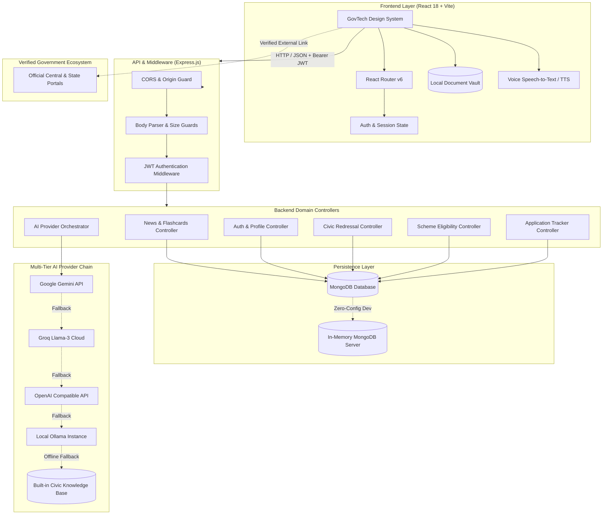

<div align="center">

# 🏛️ SevaAI — Multilingual Citizen Services & GovTech Intelligence Platform

**Bridging Citizens to Digital Governance, Welfare Schemes, and Civic Redressal Across India.**

[](https://react.dev/)
[](https://nodejs.org/)
[](https://www.mongodb.com/)
[](https://ai.google.dev/)
[](#-multilingual-support)
[](LICENSE)

[Explore Features](#-key-capabilities--modules) • [Architecture](#-system-architecture) • [Quick Start](#-quick-start--local-setup) • [API Reference](#-api-endpoints) • [Hackathon Submission](#-hackathon-submission-details)

---

</div>

## 📌 Executive Summary & Problem Statement

India's digital governance ecosystem encompasses thousands of government portals, welfare programs, municipal systems, and statutory services. However, citizens—especially in non-urban and multilingual demographics—face substantial barriers:

- **Fragmented Portals**: Welfare schemes, RTI applications, emergency helplines, and civic complaints exist on disconnected websites.
- **Language & Literacy Barriers**: Complex official jargon and lack of seamless multilingual support prevent eligible citizens from claiming their entitlements.
- **Privacy Concerns**: Citizens are hesitant to upload sensitive identification documents to untrusted cloud servers.
- **Opaque Tracking**: Lack of centralized, transparent status updates for filed grievances and scheme applications.

### 💡 The SevaAI Solution
**SevaAI** is a unified, accessible, and privacy-first digital governance portal. It empowers citizens to **discover welfare schemes**, **draft legally compliant RTI applications**, **report civic grievances with proof**, **securely manage documents locally**, and **interact with an AI assistant in 13 Indian languages**—all with zero complexity and direct one-click verification against official government portals.

---

## 🌟 Key Capabilities & Modules

```
┌─────────────────────────────────────────────────────────────────────────────┐
│                              SEVAAI PLATFORM                                │
├─────────────────────┬─────────────────────┬─────────────────────────────────┤
│ 📢 Live Flashcards  │ 🎯 Scheme Guidance  │ 📜 RTI Mitra (Form-A Drafts)    │
│ 🚨 Civic Grievances │ 📊 Unified Tracker  │ 📂 Privacy-First Document Vault │
│ 📞 112 Helplines    │ 👤 Citizen Profile  │ 🤖 13-Language AI Assistant     │
└─────────────────────┴─────────────────────┴─────────────────────────────────┘
```

### 1. 📢 Real-Time Schemes & Policy Flashcards
- **Dynamic Circular Carousel**: Displays breaking government announcements, subsidies, and welfare reforms directly on the dashboard.
- **Categorized Feeds**: Instant filtering for *Welfare Schemes* (PM-KISAN, Ayushman Bharat, PM Surya Ghar, PMAY), *National Real-Time News*, and *Civic Policies*.
- **Direct Portal Redirection**: Interactive cards directly link to verified government domains (`pmkisan.gov.in`, `nha.gov.in`, `pmsuryaghar.gov.in`, `pmaymis.gov.in`, `rtionline.gov.in`).

### 2. 🎯 Intelligent Scheme Eligibility Engine (`/scheme-eligibility`)
- **Demographic Analysis**: Matches citizen age, household income, state/UT, occupation, education, and social category against Central and State program criteria.
- **Clear Eligibility Badges**: Programs are flagged as **Eligible**, **Possibly Eligible**, or **Requires Documentation**.
- **Step-by-Step Handover**: Clear required document checklists and official application portal routing.

### 3. 📜 RTI Mitra — Right to Information Generator (`/rti-generator`)
- **Statutory Form-A Builder**: Formulates legally structured applications compliant with Rule 3(1) of the RTI Rules, 2005.
- **Live Paper Preview**: Real-time legal stationery preview with print-ready PDF export and `.txt` download.
- **Official Filing Gateway**: Direct handover to the Central RTI Online Portal (`rtionline.gov.in`).

### 4. 🚨 Civic Problem & Grievance Redressal (`/report-civic-problem`)
- **Category-Based Reporting**: Road damage & potholes, water supply & sewage leaks, garbage accumulation, and streetlight outages.
- **Evidence Attachment**: Supports photographic evidence (up to 5MB) and landmark/ward address logging.
- **Automated Tracking ID**: Instantly generates an official tracking reference and logs it into the citizen's tracker.

### 5. 📂 Zero-Knowledge Document Vault (`/document-vault`)
- **Privacy-First Local Storage**: Encrypted citizen credentials (Aadhaar, PAN, Ration Card, Income/Caste Certificates) reside strictly on the user's browser local storage.
- **Zero Cloud Leakage**: Files never touch external servers; only verification metadata is shared with explicit citizen consent during eligibility checks.

### 6. 📊 Unified Application & Grievance Tracker (`/my-applications`)
- **Multi-Service Aggregation**: View status across civic reports, scheme applications, and RTI filings in one dashboard.
- **Metric Cards**: Real-time breakdown of *Total Applications*, *In Review*, *Approved / Resolved*, and *Action Required*.
- **Interactive Timeline Drawer**: Detailed progress log with administrative remarks and tracking IDs.

### 7. 📞 Quick Access & Emergency 112 Directory (`/quick-access`)
- **National Emergency 112 Banner**: High-priority one-tap emergency call initiation.
- **Verified Directory**: State-wise and category-filtered contacts for Women Helpline (1091), Childline (1098), Cyber Crime (1930), Senior Citizens (14567), and municipal hotlines.

### 8. 👤 Citizen Profile & Identity Management (`/profile`)
- **Custom Avatar Uploader**: Photo upload, preview, and removal for custom citizen identity cards.
- **Structured Demographics**: Full Name, Email, Mobile (+91), Gender, DOB, Occupation, and Complete Residential Address.

### 9. 🤖 Multilingual AI Citizen Assistant
- **13 Indian Languages**: English, Hindi, Bengali, Telugu, Marathi, Tamil, Urdu, Gujarati, Kannada, Malayalam, Odia, Punjabi, and Assamese.
- **Multi-Provider AI Resilience**: Tiered fallback pipeline: Google Gemini ➡️ Groq Llama-3 ➡️ OpenAI ➡️ Local Ollama ➡️ Built-in Civic Knowledge Base.
- **Voice & Accessibility**: Speech-to-text voice query input and text-to-speech audio responses.

---

## 🏗️ System Architecture



---

## 💻 Tech Stack & Engineering Highlights

| Component | Technology | Purpose |
| :--- | :--- | :--- |
| **Frontend Framework** | **React 18.3.1** + **Vite 6.1.0** | Ultra-fast SPA with sub-second hot reload and optimized production bundles |
| **Routing & Navigation**| **React Router v6.29.0** | Client-side declarative routing and protected auth routes |
| **Icons & Visuals** | **Lucide React 0.475.0** | Consistent, accessible iconography |
| **Styling & UI System** | **Vanilla CSS (Design Tokens)** | Zero Tailwind bloat; 100% custom fluid typography (`clamp()`), CSS Grid, and responsive breakpoints |
| **Backend Runtime** | **Node.js (LTS)** + **Express 4.21.2** | High-concurrency RESTful API architecture |
| **Data Persistence** | **MongoDB** + **Mongoose 8.9.5** | Flexible document modeling with strict schema validations |
| **In-Memory Dev DB** | **`mongodb-memory-server` 11.2.0** | Zero-configuration embedded database for instant hackathon evaluations |
| **Authentication** | **JWT** + **Bcrypt.js 2.4.3** | Stateless token authentication with salted password hashing |
| **AI Intelligence** | **Google Gemini, Groq, OpenAI, Ollama** | Multimodal generative intelligence with offline rule-based civic fallback |

---

## 📂 Project Structure

```text
SevaAi-1/
├── backend/
│   ├── src/
│   │   ├── config/              # Database connection & memory server configs
│   │   ├── controllers/         # Feature controllers (auth, news, civic, schemes, tracking, ai, rti)
│   │   ├── middleware/          # JWT auth guard, request logging & error handling
│   │   ├── models/              # Mongoose schemas (User, ApplicationRecord, EligibilityProfile, etc.)
│   │   ├── routes/              # Express REST route endpoints
│   │   ├── services/            # Domain logic (OTP provider, tracking engine, AI orchestrator)
│   │   ├── utils/               # Built-in civic knowledge base & response formatters
│   │   ├── app.js               # Express application initialization, CORS & route mounting
│   │   ├── server.js            # Production server entry point
│   │   └── server-dev-mem.js    # In-memory MongoDB server with auto-seeding
│   ├── test/                    # Automated test suites (auth, tracking, schemes, quick-access)
│   ├── .env.example             # Backend environment template
│   └── package.json
├── frontend/
│   ├── public/
│   │   └── assets/flashcards/   # High-resolution GovTech visual banners
│   ├── src/
│   │   ├── components/          # Reusable UI widgets (Flashcards, Navbar, AI Widget, ServiceCard)
│   │   ├── context/             # AuthContext (state management, login session, user profile)
│   │   ├── pages/               # Route screens (Dashboard, Profile, Civic, Schemes, RTI, Tracker, Vault)
│   │   ├── services/            # Centralized Axios/Fetch API client
│   │   ├── styles/              # Design tokens, responsive media queries, module CSS
│   │   ├── utils/               # 13 Indian language localization dictionaries
│   │   ├── App.jsx              # Application router & protected route guards
│   │   └── main.jsx             # React DOM root
│   ├── .env.example             # Frontend environment template
│   └── package.json
├── render.yaml                  # Multi-service cloud deployment blueprint
└── README.md
```

---

## ⚡ Quick Start / Local Setup

Follow these steps to run SevaAI locally in under 2 minutes:

### Prerequisites
- **Node.js** v18.0.0 or higher
- **npm** v9.0.0 or higher

---

### Step 1: Clone Repository
```bash
git clone https://github.com/irksome06/SevaAi.git
cd SevaAi/SevaAi-1
```

---

### Step 2: Run the Backend API

1. Navigate to the backend directory and install dependencies:
   ```bash
   cd backend
   npm install
   ```

2. Copy the environment configuration:
   ```bash
   cp .env.example .env
   ```

3. **Start the server:**

   **🌟 Recommended for Hackathon Evaluation (Zero-Config In-Memory DB):**
   > *Starts an embedded in-memory MongoDB instance automatically in a clean state.*

   **Or with Local/Cloud MongoDB:**
   ```bash
   npm run dev
   ```

   The backend API will start at **`http://localhost:5000`**.

---

### Step 3: Run the Frontend Web Application

1. Open a second terminal window, navigate to the frontend, and install dependencies:
   ```bash
   cd frontend
   npm install
   ```

2. Start the Vite development server:
   ```bash
   npm run dev
   ```

3. Open your browser:
   👉 **`http://localhost:5173`**

---

## ⚙️ Environment Variables

### Backend Configuration (`backend/.env`)

```ini
# Server Configuration
PORT=5000
NODE_ENV=development
CLIENT_URL=http://localhost:5173

# Database (Not required when using npm run dev:mem)
MONGODB_URI=mongodb://localhost:27017/sevaai

# Authentication & Security
JWT_SECRET=sevaai-super-secure-jwt-token-key-2026
JWT_EXPIRES_IN=7d

# SMS OTP Provider (mock | fast2sms | twilio | msg91 | twofactor)
SMS_PROVIDER=mock

# AI Provider Keys (Optional — falls back to civic knowledge engine if omitted)
GEMINI_API_KEY=
GROQ_API_KEY=
OPENAI_API_KEY=
OLLAMA_BASE_URL=http://127.0.0.1:11434
OLLAMA_MODEL=llama3.2:1b
```

### Frontend Configuration (`frontend/.env`)

```ini
# Base API URL (Leave blank to use Vite's automatic backend proxy)
VITE_API_URL=http://localhost:5000
```

---

## 📡 API Endpoints

All backend endpoints are prefixed with `/api`.

| Module | Method | Endpoint | Access | Description |
| :--- | :--- | :--- | :--- | :--- |
| **System** | `GET` | `/health` | Public | Health status, uptime, and environment check |
| **Auth** | `POST` | `/auth/register` | Public | Register a new citizen account |
| | `POST` | `/auth/login` | Public | Authenticate via Email or Phone + Password |
| | `POST` | `/auth/send-otp` | Public | Send 6-digit verification OTP to mobile |
| | `POST` | `/auth/verify-otp` | Public | Verify OTP and return authenticated JWT |
| | `GET` | `/auth/me` | Protected | Fetch current authenticated citizen profile |
| | `PUT` | `/auth/profile` | Protected | Update profile demographics, address, and avatar |
| **News** | `GET` | `/news` | Public | Retrieve live scheme circulars and national news |
| **Schemes** | `GET` | `/schemes/profile` | Protected | Get citizen's scheme eligibility demographics |
| | `PUT` | `/schemes/profile` | Protected | Save/update scheme eligibility profile |
| | `GET` | `/schemes/recommendations` | Protected | Compute and fetch matched welfare schemes |
| | `POST` | `/schemes/:id/start` | Protected | Initiate application and record in tracker |
| **Civic** | `POST` | `/civic/official-routing`| Protected | Resolve municipal authority routing for grievance |
| **Tracking** | `GET` | `/tracking` | Protected | Fetch all citizen grievance/application records |
| | `POST` | `/tracking` | Protected | File and create a new tracking record |
| | `GET` | `/tracking/:id` | Protected | Get single record with full historical timeline |
| **RTI** | `GET` | `/rti/official-portal` | Public | Retrieve verified Central RTI submission URL |
| **Directory**| `GET` | `/quick-access` | Public | Fetch emergency contacts and helpline directory |
| **AI** | `POST` | `/ai/chat` | Public | Ask the multilingual citizen AI assistant |

---

## 🔒 Security & Privacy Architecture

- **Bcrypt Password Hashing**: Passwords are salted and hashed (cost factor 10) prior to persistence.
- **Stateless JWT Authorization**: Protected routes enforce valid JSON Web Tokens in the `Authorization: Bearer <token>` header.
- **Zero-Knowledge Vault Storage**: Sensitive identification documents are stored strictly in client-side `localStorage`, preventing data breaches on centralized servers.
- **AI Safety & Privacy Guardrails**: System prompts strictly forbid the AI assistant from asking for or recording passwords, OTPs, or Aadhaar numbers.
- **Strict Size Limits**: 10MB payload limit prevents Denial of Service (DoS) attempts via payload exhaustion.

---

## 🧪 Automated Testing & Production Build

### Execute Backend Test Suites
```bash
cd backend
npm test                  # Auth integration tests
npm run test:tracking     # Application tracker tests
npm run test:schemes      # Scheme eligibility logic tests
npm run test:quick-access # Emergency directory tests
```

### Production Build Validation
```bash
cd frontend
npm run build
```
*Compiles the production-optimized bundle into `frontend/dist/` with 0 warnings or errors.*

---

## 🚀 Cloud Deployment

The repository includes a production-ready **`render.yaml`** configuration:

1. **`sevaai-backend`**: Node.js Web Service on Render with automatic environment binding.
2. **`sevaai-frontend`**: High-performance Static Site hosting the Vite SPA bundle with client-side SPA routing rewrites (`_redirects`).

---

## 🏆 Hackathon Submission Details

| Field | Detail |
| :--- | :--- |
| **Project Title** | **SevaAI — Multilingual Citizen Services & GovTech Intelligence Platform** |
| **Target Sector** | Governance, Citizen Services, Public Welfare, Digital India, GovTech |
| **Primary Beneficiaries**| Indian Citizens, Rural & Semi-Urban Populations, Beneficiaries of Welfare Schemes |
| **Key Innovations** | • Unified 9-in-1 Citizen Governance Portal<br>• Real-time Scheme Circular Flashcards with 1-Click Verification<br>• Statutory RTI Form-A Rule 3(1) Automated Draft Engine<br>• Zero-Knowledge Local Document Vault<br>• Resilient Multimodal AI Provider Chain with Offline Fallback |
| **Repository URL** | [https://github.com/irksome06/SevaAi](https://github.com/irksome06/SevaAi) |
| **License** | Open-Source under the [MIT License](LICENSE) |

---

<div align="center">

**Built with pride for digital empowerment, accessibility, and public transparency.**

</div>
