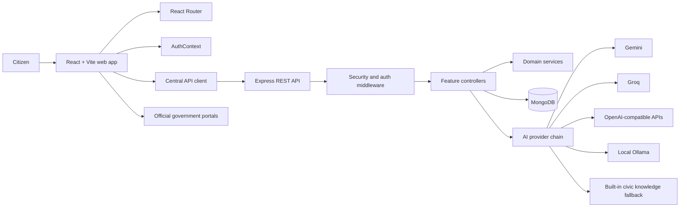

# SevaAI

SevaAI is a multilingual citizen-services platform for accessing public-service guidance, reporting civic issues, discovering government schemes, preparing RTI applications, managing documents, and tracking applications.

The project combines a React web application with an Express REST API. It is designed for citizens who need clear, actionable guidance without navigating multiple government service websites first.

## Contents

- [Capabilities](#capabilities)
- [Architecture](#architecture)
- [Technology](#technology)
- [Repository structure](#repository-structure)
- [Run locally](#run-locally)
- [Configuration](#configuration)
- [API overview](#api-overview)
- [Security](#security)
- [Testing and build](#testing-and-build)
- [Deployment](#deployment)

## Capabilities

- Multilingual authentication with email/password and phone OTP flows
- AI citizen assistant with text, image, and supported document input
- Civic complaint drafting for roads, waste, water, drainage, and streetlight issues
- RTI application generation with applicant details, supporting documents, and PDF-ready output
- Government scheme discovery and eligibility guidance
- Application and grievance tracking
- Local document vault for citizen records
- Quick access to emergency helplines and verified service contacts

## Architecture



### Request flow

1. The browser renders a route and collects citizen input.
2. The shared API client adds the authorization token and sends a JSON request.
3. Express routes the request through validation and authentication middleware.
4. Controllers coordinate domain services and persistence.
5. AI requests try configured providers in order and fall back to the built-in civic knowledge engine when no provider is available.

## Technology

| Layer | Technology |
| --- | --- |
| Web application | React 18, Vite, React Router 6, Lucide React |
| API | Node.js, Express |
| Persistence | MongoDB with Mongoose |
| Authentication | JWT, bcryptjs, phone OTP providers |
| AI | Gemini, Groq, OpenAI-compatible APIs, or local Ollama |
| Styling | CSS design tokens and feature-specific styles |
| Deployment | Render configuration in `render.yaml` |

## Repository structure

```text
SevaAi-integrated/
├── backend/
│   ├── src/
│   │   ├── config/          Database configuration
│   │   ├── controllers/     Request and response orchestration
│   │   ├── middleware/      Authentication and request guards
│   │   ├── models/          Mongoose schemas
│   │   ├── routes/          REST route definitions
│   │   ├── services/        OTP, tracking, quick access, and eligibility logic
│   │   ├── utils/            Shared backend utilities
│   │   ├── app.js           Express application setup
│   │   └── server.js        Production server bootstrap
│   ├── test/                Backend test suites
│   ├── .env.example         Backend configuration template
│   └── package.json
├── frontend/
│   ├── src/
│   │   ├── components/      Reusable UI components
│   │   ├── context/         Authentication and global state
│   │   ├── pages/           Route-level screens
│   │   ├── services/        Centralized API client
│   │   ├── styles/          Global and feature styles
│   │   ├── utils/            Shared frontend utilities
│   │   ├── App.jsx          Application routes
│   │   └── main.jsx         React entry point
│   ├── .env.example         Frontend configuration template
│   └── package.json
├── render.yaml              Render backend and frontend services
└── README.md
```

## Run locally

### Prerequisites

- Node.js 18 or later
- npm 9 or later
- MongoDB locally or a MongoDB Atlas connection string

### Start the backend

```bash
cd backend
npm install
cp .env.example .env
npm run dev
```

The API starts at `http://localhost:5000`.

For development without a local MongoDB installation, use the embedded MongoDB server:

```bash
npm run dev:mem
```

### Start the frontend

Open a second terminal:

```bash
cd frontend
npm install
npm run dev
```

The web app starts at `http://localhost:5173` and proxies `/api` requests to the backend.

## Configuration

Copy `backend/.env.example` to `backend/.env` and configure the values required for your environment.

| Variable | Purpose |
| --- | --- |
| `PORT` | Express port; defaults to `5000` |
| `MONGODB_URI` | MongoDB connection string |
| `JWT_SECRET` | Secret used to sign access tokens |
| `JWT_EXPIRES_IN` | Token lifetime, for example `7d` |
| `SMS_PROVIDER` | `mock`, `fast2sms`, `twilio`, `msg91`, or `twofactor` |
| `GEMINI_API_KEY` | Optional Gemini provider key |
| `GROQ_API_KEY` | Optional Groq provider key |
| `OPENAI_API_KEY` | Optional OpenAI-compatible provider key |
| `OLLAMA_BASE_URL` | Local Ollama URL; defaults to `http://127.0.0.1:11434` |
| `OLLAMA_MODEL` | Local Ollama model; defaults to `llama3.2:1b` |

At least one AI provider is recommended for generative answers. When cloud providers and Ollama are unavailable, the API returns structured answers from its built-in civic knowledge engine.

Never commit `.env` files, API keys, JWT secrets, OTP credentials, or database credentials.

## API overview

All API routes are prefixed with `/api`.

| Method | Endpoint | Access | Purpose |
| --- | --- | --- | --- |
| `GET` | `/health` | Public | Service health and uptime |
| `POST` | `/auth/register` | Public | Register a citizen account |
| `POST` | `/auth/login` | Public | Authenticate with email and password |
| `POST` | `/auth/send-otp` | Public | Request a phone OTP |
| `POST` | `/auth/verify-otp` | Public | Verify an OTP and authenticate |
| `GET` | `/auth/me` | Protected | Read the current citizen profile |
| `POST` | `/ai/chat` | Public | Ask the multilingual assistant |
| `GET` | `/rti/official-portal` | Public | Return the configured official RTI submission portal |
| `GET/POST/PATCH` | `/tracking` | Protected | Read and update application tracking records |
| `GET` | `/quick-access` | Public | Read verified contacts and helplines |
| `GET/PUT` | `/schemes/profile` | Protected | Save and read eligibility details |
| `GET` | `/schemes/recommendations` | Protected | Get scheme recommendations |

Protected requests use:

```http
Authorization: Bearer <jwt-token>
```

## Security

- Passwords are hashed with bcrypt before persistence.
- Protected routes require a signed JWT bearer token.
- OTP values are short-lived, single-use, and stored as hashes rather than raw codes.
- AI requests validate message history, attachment count, file type, and file size.
- The AI system prompt prevents the assistant from requesting passwords, OTPs, or Aadhaar numbers.
- Production secrets are supplied through deployment environment variables.

## Testing and build

Frontend production build:

```bash
cd frontend
npm run build
```

Backend checks:

```bash
cd backend
npm test
npm run test:tracking
npm run test:quick-access
npm run test:schemes
```

## Deployment

`render.yaml` defines two services:

- `sevaai-backend`: Node web service backed by MongoDB
- `sevaai-frontend`: Vite static site with `/api` configured through `VITE_API_URL`

Before deploying, configure `MONGODB_URI`, `JWT_SECRET`, any SMS provider credentials, and at least one production AI provider in the hosting platform. Set the frontend `VITE_API_URL` to the public backend URL and verify `/api/health` after deployment.

## Project status

SevaAI is an evolving application. Government scheme rules, helpline details, and official portal availability can change; users should verify important submissions against the relevant government authority before acting.
